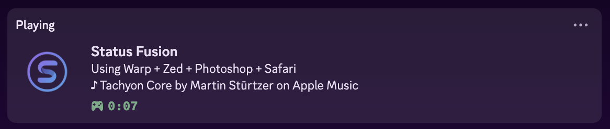
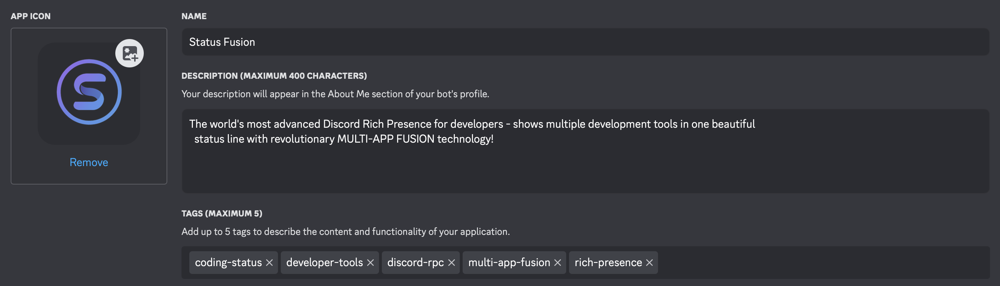

# Discord Status Fusion

<p align="center">
  
</p>

AI-powered Discord Rich Presence that intelligently displays your current professional applications and music.

## 📸 Preview

<p align="center">
  
</p>

## ✨ Features

- **🤖 AI-Powered Status Generation**: Uses Gemini 2.5 Flash-Lite for intelligent status formatting
- **🎯 Professional App Detection**: Automatically detects and displays work-relevant applications
- **🎵 Music Integration**: Shows currently playing music from Apple Music and Spotify
- **⚡ Smart Change Detection**: Only updates when your apps or music actually change
- **🎮 Gaming Friendly**: Does not override gaming status from Steam, Discord games, etc.
- **🔧 Simple Setup**: Minimal configuration required
- **🌍 Cross-Platform**: Supports macOS, Windows, and Linux

## 🚀 Quick Start

### Prerequisites

- Node.js 16 or higher
- Discord account
- Google AI API key

### Installation

1. **Clone the repository**
   ```bash
   git clone https://github.com/Zollicoff/discord-status-fusion.git
   cd discord-status-fusion
   npm install
   ```

2. **Create Discord Application**
   - Go to [Discord Developer Portal](https://discord.com/developers/applications)
   - Create a new application
   - Copy the Application ID

   <p align="center">
     
   </p>

3. **Get Google AI API Key**
   - Visit [Google AI Studio](https://aistudio.google.com/app/apikey)
   - Create a new API key

4. **Configure API Key (Secure)**
   
   **macOS:**
   ```bash
   security add-generic-password -s "GOOGLE_AI_API_KEY" -a "$(whoami)" -w "your-api-key-here"
   ```
   
   **Windows:**
   ```cmd
   cmdkey /add:GOOGLE_AI_API_KEY /user:discord-status-fusion /pass:your-api-key-here
   ```
   
   **Linux:**
   ```bash
   secret-tool store --label="Google AI API Key" service "GOOGLE_AI_API_KEY" username "discord-status-fusion"
   # Enter your API key when prompted
   ```

5. **Configure Environment**
   ```bash
   cp .env.example .env
   # Edit .env and add your Discord Application ID
   ```

6. **Run**
   ```bash
   npm start
   ```

## 🎯 How It Works

1. **Process Detection**: Scans your running applications
2. **Professional Filtering**: Identifies work-relevant software using a curated whitelist
3. **AI Formatting**: Gemini AI intelligently selects and formats the best 4 apps
4. **Music Detection**: Detects music from Apple Music and Spotify
5. **Discord Update**: Updates your Rich Presence with the generated status

## 🛠️ Supported Applications

**Development Tools:** Cursor, VS Code, Xcode, Warp Terminal, IntelliJ, PyCharm, etc.

**Creative Software:** Adobe Photoshop, Illustrator, After Effects, Figma, Sketch, etc.

**Office & Productivity:** Microsoft Office, Notion, Obsidian, Keynote, etc.

**Professional Tools:** Docker, Postman, TablePlus, Wireshark, etc.

**Browsers:** Chrome, Safari, Firefox, Arc, etc.

## 📱 Example Status

```
🎯 Using Cursor + Photoshop + Safari + Excel
   └─ ♪ Song Name by Artist on Apple Music
```

## ⚙️ Configuration

### Environment Variables

Create a `.env` file:

```bash
# Required
DISCORD_CLIENT_ID=your_discord_application_id_here

# Optional
LOG_LEVEL=info  # Available: error, warn, info, debug, verbose
```

### Adding New Applications

To add support for a new professional application, edit the whitelist in `src/core/detector.js` and add the appropriate regex pattern.

## 🔧 Troubleshooting

### Common Issues

**"No API key found"**: Ensure you've stored your Google AI API key in the system keychain using the commands above.

**"Discord connection failed"**: Make sure Discord is running and your Application ID is correct.

**"App not detected"**: Check if your application is in the professional apps whitelist in `src/core/detector.js`.

## 🤝 Contributing

Contributions are welcome! Please focus on:

- Adding new professional applications to the whitelist
- Improving cross-platform compatibility
- Bug fixes and optimizations
- Documentation improvements

## 📄 License

MIT License - see LICENSE file for details.

## 🔗 Links

- [GitHub Repository](https://github.com/Zollicoff/discord-status-fusion)
- [Discord Developer Portal](https://discord.com/developers/applications)
- [Google AI Studio](https://aistudio.google.com/app/apikey)

---

*Intelligent Discord status generation powered by AI.*